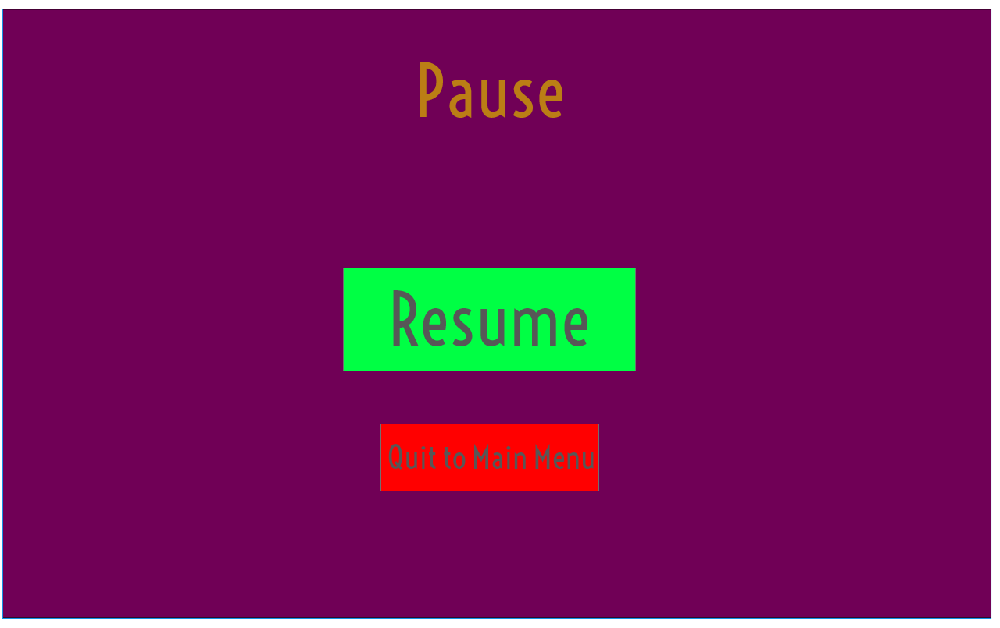
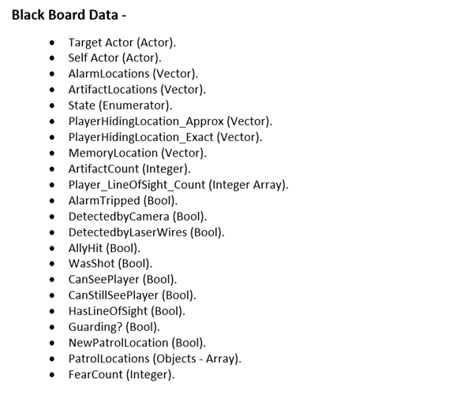

<p align = "center">
**Monsieur Moneh**
==================
> **Prepared for: Vancouver Film School, Technical Pre-production, and Term 4.**    
> **Prepared by: Learning Machines, GD52 and PG14.**    
> **April 9 2019.**    
> **Version Number: 1.01.** 

----------
## **Table of Contents**
[**Product Overview**](#1.-product-overview)
*   [Mechanics](#1.1.-mechanics)
*   [Scope Statement](#1.2.-scope-statement)

[**Mockups**](#2.-mockups)
*   [Screen Flowchart](#2.1.-screen-flowchart)
*   [Main Menu](#2.2.-mainmenu)
*   [HUD](#2.3.-hud)
*   [Pause Menu](#2.4.-pause-menu)
*   [Controls](#2.5.-controls)
*   [Game Over Screen](#2.6.-game-over-screen)
*   [Credits](#2.7.-credits)
*   [Settings](#2.8.-settings)

[**Requirements & Milestone Planning**](#3.-requirements-&-milestone-planning)

[**Technical Implementations**](#4.-technical-implementations)
*   [People](#4.1.-people)
*   [Hardware and Software Requirements](#4.2.-hardware-and-software-requirements)
*   [Project Organization & Naming Conventions](#4.3.-project-organization-&-naming-conventions)
*   [Requirements and Features](#4.4.-requirements-and-features)
    *   [Player](#player)
    *   [Guards](#guards)
    *   [User Interface](#user-interface)
    *   [Audio](#audio)
    *   [Levels](#levels)
    *   [Animations](#animations)
    *   [Non-Functional requirements](#non-functional-requirements)

[**UML Diagrams**](#5.-uml-diagrams)
*   [AI Diagrams](#5.1.-ai-diagrams)
*   [Player Diagram](#5.2.-player-diagram)
*   [Class Diagram](#5.3.-class-diagram)

[**Coding Conventions**](#6.-coding-conventions)

[**Milestone Planning**](#7.-milestone-planning)


----------

## **1.	Product Overview**
Monsieur Monet is a single player, third-person stealth game where you play as the titular gentleman thief as you infiltrate a museum in search of The Phine Pharaoh’s Phace! Sneak your way through the museum with your trusty freeze gun, and claim your prize!

## **_1.1. Mechanics_**
The player will have multiple actions that can be performed. These include: Walking, Running, Crouching, Stealth, Aiming, Shooting, and more.

*    **Stealth -** <p align = "justify"> Sneak around the level and remain undetected by the guards by combing the various traditional stealth elements such as; visibility, sneaking around undetected, Noise detectors, security cameras and laser wires and more. Cover locations and hiding spots make it more fun to play as players have placed to hide and plan ahead and keeps the players on their toes as hiding in same spots frequently increases their chances of being discovered by the guards.

*    **Notoriety System -** <p align = "justify"> Multiple levels of detection, AI alert other AIs depending on the notoriety level of the player. Notoriety in this context refers to the state of the AI and the state the AI is in is adversely affected by the player's behaviors and actions in game.

*    **Inventory System to discard picked up items -** <p align = "justify"> Helps players regain their  speed by dropping items. The dropped items also act as distraction for the guards (enemy AI).

*    **Stealing artifacts along the way -** <p align = "justify"> Players can pick up artifacts and gold along the way to increase their high score but have to compromise on walk/run speed. While this feature is fun to play with, it comes with a risk. The guards patrol every route and if the guards find any of the objects missing, they might either alert other guards or be on the lookout themselves. This featured works great as a risk vs reward factor and makes the gameplay that much more interesting.

*    **Combat -** <p align = "justify"> Combat takes place in two different situations in the game; the enemy attacking the player character when detected by a guard or freezing enemies to get away and hide. Either way the game doesn't get into a full scale combat as combat is not a core pillar of the game. Enemies can only perform short range attacks, as they are only equipped with batons, and players are equipped with a medium range weapon which cannot be used in a greater frequency at once as the gun requires time to cool down once used.

*    **Level Design -** <p align = "justify"> The level is designed for a huge Museum with lots of artifacts and hiding spots available to the player. The level would be built supporting the core mechanics and core pillars of the game, thus helping engage the players further into the game.

*    **AI Design -** <p align = "justify"> The game has 3 AIs incorporated within the game - 1. AI in Camera work, 2. Enemy AI, 3. AI showing the players the path they need to take and the cover positions. AI in camera work includes the camera moving and blending along with the player actions (EX - camera perspective changes when the player hides or under cover or prone). Enemy AI would be constructed and developed based on Behavior Tree models that lets the enemy controller perform the various tasks based on the tasks and services assigned to them. The Enemy AI would also have probability and randomness implemented in them to choose what dialogues and tasks to perform in certain situations. The AI showing the players the path they need to take is useful to guide the player where they have to go next and also possible cover locations are also revealed. Though Lighting in Level Design help guide the player to a great extent, this AI guides the player even better and also helps them complete the game faster as the game is intended to be under 5-10min.

## **_1.2.	Scope Statement_**
<p align = "justify">
        The end product is a 3D, 15-minute 3rd person stealth game made in Unreal. The player plays as the protagonist in an attempt to steal the artifacts from the grand museum. The game consists of one playable character (protagonist) and a couple non-playable characters as guards guarding the museum. The game would be developed based on stealth and AI as they're the core mechanics of the game and the game also features mechanics such as combat and a notoriety system. The game consists of one big level and will contain several unique environment assets. The game will be developed by a team of 6 passionate individuals in a 5 month time frame.

----------

## **2.	Mockups**
<p align = "justify">
Monsieur Moneh features a cartoonish styled User Interface. There is a total of 6 screens in the game: Main Menu, Settings, Controls, Credits, Pause and Game Over. Wireframes and Mock-Ups are included for the screens that feature multiple interaction choices.

## _**2.1.	Screen Flowchart**_


## _**2.2.  MainMenu**_


## _**2.3.  HUD**_


## _**2.4.  Pause Menu**_


## _**2.5.  Controls**_


The following key bindings are designed with a controller in mind.
*    A: Sprint.
*    B: Drop artefact.
*    X: Crouch/Stand-up.
*    Y: Open inventory.
*    1: Camera.
*    2: Scroll through inventory.
*    3: Movement.
*    4: Map.
*    5: Slide.
*    6: Aim.
*    8: Pause.
*    9: Shoot.
*    10: Interact: Enter Closets/Statues, Grab Artifact, Open/Close Doors.

## _**2.6. Game over Screen**_


## _**2.7. Credits**_


## _**2.8. Settings**_


----------------------

## **3.	Requirements & Milestone Planning**
As of April 1, 2019…


--------------------------

## **4.	Technical Implementations**
## **_4.1.	People_**

<p align ="center"> Project Members |   <p align ="center"> Project Team Role   |	<p align ="center"> Responsibilities
--------------- | --------------------- | ------------------
Czarina Ramos   |	Project Manager, Programmer |   Manage the Project and the team. Maintain documentation and schedule. Collaborate with Testing sessions and reports. Code and Implement Mini-map elements, Shooting and Stealth elements.
Vincent Pitre   |   Concept Artist, Character Artist, Animator  |   Draw Concept Art, model and texture characters and animate characters.
Prathap Ravichander |   Programmer, QA  |   Code and implement a lot of the game’s mechanics, AI, camera, character, controller, UI, Inventory and Stealth Elements. Collaborate with Testing sessions and reports.
Haad Hassan |  Level designer  |  Paper plan, white-box and set dress the game’s level. Light mapping and lighting implementation.
Chris Lapointe  |   Designer and UI, Narrative Designer |   Design UI, UX and Narrative of the game. Game balancing and working on updating  the GDD.
Bryan Lee   |   Environmental Artist, Visual FX Artist  |   Model and TextureEnvironmental assets. Create and implement FX particles.
XXXXXXX     |   Sound Designer  |   Compose or research public domain music, create and edit Sound Effects.
----------------

## _**4.2.	Hardware and Software Requirements**_
### **Hardware:**
* 6 computers equipped with Intel Xeon E5-1620 V4 CPUs, 32GB of RAM and NVidia Quadro 4000 GPUs.
* 6 mice, keyboards, gamepads and headphones.
* 2 Wacom tablets.

### **Software:**
* 6 licenses of Microsoft Windows 10 Professional.
* 6 subscriptions of Microsoft Skype for Business, Microsoft Visual Studio, Microsoft Visio Pro, Unreal Engine (Free), Autodesk Maya, Adobe Creative Cloud, Substance Designer and Substance Painter.
* Subscriptions of Perforce, Pivotal Tracker Pro and Microsoft Office 365 Home.

## _**4.3.	Project Organization & Naming Conventions**_
We intend to follow the (Prefix_)AssetName(_Suffix) template. Only a-z, A-Z, 0-9 and _ characters are allowed. A project organization in folders with the respective Naming Conventions follows.

### **Audio Files:**
### Music:
    BGM_MusicName_00.wav

### Ambient Sounds:
    AMS_AmbientSoundName_00.wav

### Sound Effects:
    SFX_SoundEffectName_00.wav

### Voice Overs:
    DIA_VoiceOvername_00.wav

### **Data:**
### Maps:
	Map_Museum_00.umap

### Classes:
	MonsieurMonehCharacter.h
	MonsieurMonehCharacter.cpp
	MonsieurMonehGameMode.h
	MonsieurMonehGameMode.cpp
	AI_GuardController.h
	AI_GuardController.cpp
	AI_GuardCharacter_01.h
	AI_GuardCharacter_01.cpp
	AI_GuardCharacter_02.h
	AI_GuardCharacter_02.cpp
	AI_GuardCharacter_03.h
	AI_GuardCharacter_03.cpp
	AI_BlackboardData.uasset
	AI_BehaviorTree.uasset
	AI_BrainServiceComponent.h
	AI_BrainServiceComponent.cpp
	BTTask_TaskName.h
	BTTask_TaskName.cpp
	MM_Interactables.h
	MM_Interactables.cpp
	MM_Pickups.h
	MM_Pickups.cpp
	MM_HidingSpots.h
	MM_HidingSpots.cpp
	MM_Inventory.h
	MM_Inventory.cpp
	BP_Minimap.uasset
	BP_HUD.uasset
	MM_Minimap.h
	MM_Minimap.cpp

### Materials:
	Mat_MaterialName.uasset

### Textures:
	Tex_TextureName.png/jpg/tga

### Animation Blueprints:
	ABP_AnimationBlueprintName.uasset
	BS_BlendSpaceName.uasset
	AO_AimOffsetBlendSpaceName.uasset

### Models:
	Skl_CharacterName.uasset
	Anim_Charactername_AnimationType.uasset
	SM_EnvironmentalMeshName.uasset

### Fonts:
	F_FontName.tff

## **_4.4.	Requirements and Features_**
## Player:
* ### **Walk:**
    <p align = "justify">
        The force applied to the joystick on the controller will affect the speed at which the player moves. The camera always faces the back of the player’s head and shoulders, allowing the player to move backwards, forwards or strafe side to side. Going up the stairs or an inclined surface in a forward direction will slow the player down, while going down the aforementioned surfaces will speed them up slightly. Doing the same while going backwards or to the side however will inevitably slow the player down.

* ### **Run:**
    <p align = "justify">
        Pressing and holding the A button on the controller the player can start sprinting. Sprinting increases the speed of the player character to 450.0f (all the way from 150.0f), releasing the button gradually sets the player character’s speed back to 150.0f.   

* ### **Aim:**
    <p align = "justify">
        When the player holds down the left-trigger button of the controller they will enter a state of ‘aiming’, in which the character holds out their gun and is able to shoot. While aiming, the player’s movement is slowed dramatically. In addition, the player cannot run while aiming and cannot aim while crouching. The player is given a crosshair (which is visible only when the player enters the aiming state.) to use while aiming. This is meant to assist the player in shooting the enemies precisely. The camera during aiming zooms in on the target and allows the player to move the crosshair/gun around to shoot the desired target.  

* ### **Crouch:**
    <p align = "justify">
        Toggling the X button on the controller allows the players to crouch or stand back up. Crouching reduces the player’s speed by almost half and players are not allowed to sprint or aim while crouching. The speed of the player, while crouching, is reduced to 80.0f.

* ### **Shoot:**
    <p align = "justify">
        Holding down both Left-trigger and the Right-Trigger buttons on the controller allows players to shoot. The shooting mechanic in the game is limited to freezing the enemies (guards), security cameras, laser traps/wires and more. To balance the gameplay and the stealth elements of the game, the gun’s rate of fire is limited by a cool-down timer, where players are required to wait 10.0 seconds until they can shoot again.

* ### **Interact:**
    <p align = "justify">
        Pressing the Right shoulder button of the controller lets the player interact with the artifacts to steal them, enter closets to hide from the guards and open/close doors. 
        Players can steal artifacts when close to one by pressing the Interact button and each type of artifact displays its value, effect on player and picture in a pop-up that pops up when close to one. Stealing artifacts can have various effects on the players such as strength and speed boosts but each item boosts and negates player stats, which lets the players choose to strategize the items they need to steal..
        Player can interact with closets and various hiding locations placed throughout the level to break line of sight of the guards and stay undetected momentarily. But hiding in the same location, breaking the line of sight of the same guard leads to the guard discovering the location and that particular spot becomes unavailable to hide anymore.

* ### **Inventory:**
    <p align = "justify">
        Pressing the Y button on the controller toggles the Inventory. The inventory stores the data of the items picked up along with their values. The inventory is used for discarding items only. Discarding items from the inventory is done for the following reasons; to distract the guards by dropping the artifacts on the ground, balance character stats and to increase the total value carried around by the player character.

* ### **Health:**
    <p align = "justify">
        Player’s health will be displayed only when aiming/shooting or when the AI guards transition to the combat state. The max health of the player character is 100.

* ### **Camera:**
    <p align = "justify">
        The camera operates in a 3rd person perspective most of the game. The camera is controlled by AI when the player crouches, hides in hiding spots, enters narrow spaces/locations. The Camera AI Director takes control over the camera at such situations/circumstances and changes the camera’s perspective and angle accordingly and avoids colliding into any meshes whatsoever.

* ### **Path showing (AI):**
    <p align = "justify">
        When the player character is idle for more than 3-5 seconds, an alternate version of the character, with very low opacity and highlighted, shows the players the critical path little by little so players are not lost completely.

* ### **Map and Mini-map:**
    <p align = "justify">
        The game features a map that shows the whole level, player location and objective overview on press of a button (Select/button 11.). The game also features a mini-map that is rendered on scree at all times that lets the players be aware of enemy locations, the noise they produce and the visibility range of the guards.  

## Guards:
<p align = "justify">
        The guards take turns patrolling and guarding certain areas. There’s a notoriety system in place that lets the guards transition from patrolling/guarding states to caution, alert and combat states respectively. Player can use the artifacts acquired to distract the guards by dropping them on the ground and the guards would then pick them off the ground if found and return it to any empty cases in the lost/found room in the museum. Dropping a lot of artifacts can arouse suspicion to the guards and the guards would then be alerted of someone being in the same building as them and look for the player more intently. 
        Guards also are alerted if security cameras detect players or laser wires are tripped by players. This makes some guards to inspect the location the wires were tripped or players were detected by cameras. (Alarm systems are usually triggered when laser wires are tripped or when cameras detect players). 
        Guards change their patrol locations to the new locations if they hear too much noise or suspect activity often in certain areas. Guards can be frozen momentarily by the players to escape and/or hide. The first time any guard is frozen, they’re going to be actively looking for the player but will not let the other guards know anything about it as they’ll be embarrassed about it. But if attacked more than twice, they will notify the other guards and this leads them to transition into a high-alert state which makes it a lot more difficult for the player to sneak around successfully. The state will reset if the player is not found for about 30 seconds. 
        Guards also use the alarm systems placed throughout the level to alert other guards when the freeze gun is aimed at them.

Following are the features of the guards based on the player's actions and game's state:
*   **Notoriety:**<p align = "justify">
The game features a notoriety system, where the AI guards, upon detecting the player, alert and report to the other guards and actively search for the player. The more an action is performed by the player, the guards recognize that and come up with counter measures and their alert states go high.
			
*   **Security Cameras:**<p align = "justify">
The game also features AI controlled security cameras that keep looking for the player (left to right - about 45 degrees each side) and will trigger the alarm systems when the player character is detected and this causes the guards to run to the location where the alarm was triggered and begin searching for the player.

*   **States:** <p align = "justify">
	The AI states of the guards traverse along the Behavior Tree. The condition checks for each of the states happen with the help of a Behavior Tree Service and various Behavior Tree Tasks that help execute the behaviors when the AI meets a certain state.

    Below is an image of a list of states used in the game:

    

*	**Blackboard Data:**<p align = "justify">
	Blackboard Data allows the AI Behavior Tree to choose the data and variables from the blackboard and use it among various tasks and services to execute the behaviors successfully. Below is an image of a list of the variables and their types used by the Behavior Tree:

    

*	**Types of Enemies:**<p align = "justify">
    *   Brute: Large and strong guard. This guard type does the most damage but is the slowest when they run. 

    *   Regular: A normal guard that is has a similar body type as Monsieur Monet. This guard has a balance of attack damage and run speed. 

    *   Swift: A shorter, skinny guard that does not do that much damage when he attacks but he is the fastest and is hard to lose when he is chasing Monsieur Monet.

## User Interface: 
*   Main Menu.
*   Pause Menu.
*   HUD.
*   Game Over screen.
*   Credits screen.
*   Map screen.
*   Inventory screen.
*   Loading Screen.
 
## Audio: 
*   **SFX -** 
    *   Player –
        *   Footsteps.
        *   Freeze gun.
        *   Shoot.
        *   Cooldown (freeze gun).
        *   Death.
        *   Hit Reactions.
        *   Picking up artifacts.
        *   Dropping artifacts.
        *   Other distractions.

    *   Guards (AI) –
        *   Footsteps.
        *   Radio static.
        *   Alerting other guards (shouting to the other guards).
        *   Alerting other guards (Shouting at the payer).
        *   Talking over radio.
        *   Picking up an artifact.
        *   Putting the artifact back.
        *   Frozen.
        *   Breaking free from ice.
        *   Stingers (When the player has been detected).
        *   Attacking/ hitting the player (with a baton).

    *   In-Game –
        *   Laser wires.
        *   Security camera detecting the player.
        *   Alarm systems.
        *   Scrolling through Inventory.
        *   UI Sounds.


*   **Music -**
    *   Ambient sound.
    *   Background Music.
    *   Tension build-up during detection.
    *   Music Pacing (based on the intensity of the level/game).

## Levels: 
*   One Museum.
*   A minimum of 3-4 rooms.
*   Each room with different personalities.
*   Each room with a different acoustic environment.

## Animations: 
*   **Player -**
    *   Walking.
    *   Idle.
    *   Sprint.
    *   Aim.
    *   Crouch.
    *   Shoot.
    *   Hit Reactions.
    *   Death.
    *   Picking up artifacts.
    *   Dropping artifacts.

*   **Guards (AI) -**
    *   Walk.
    *   Idle.
    *   Run/Sprint.
    *   Talk over the radio.
    *   Use Alarm systems.
    *   Look around.
    *   Picking up artifacts.
    *   Putting the artifact back.
    *   Frozen.
    *   Shivering (after breaking free from being frozen)
    *   Look for player.
    *   Open Hiding spots.
    *   Point at player.

## Non-Functional Requirements:
*   Keeping the players on the edge.
*   Visually appealing.
*   Making the player aware of the situation and surroundings with sound.
*   Bug free (as much as possible).
*   A stunning gameplay experience.

---------------------

## **5.	UML Diagrams**
## **_5.1. AI Diagrams_**


### **Breaking the diagram further for clarity -**


### **States -**


### **Blackboard Data -**


## **_5.2. Player Diagram_**


## **_5.3. Class Diagram_**


---------------------

## **6. Coding Conventions**
### **Variables:**
```cpp
public:
UPROPERTY (EditAnywhere, BlueprintReadWrite)
float MyFloat;

private:
UPROPERTY (EditAnywhere, BlueprintReadWrite)
float myFloat;

protected:
UPROPERTY()
bool bIsBool;
```

### **Layout Convention:**
```cpp
//If statement.
if (bvar == true && bvar == 0)
{
    //code goes in here.
}

//Ranged-for UE4.
for (AActor *Actor : Actors)
{
    //code goes in here.
}
```

### **Classes, Enums and Structs:**
```cpp
//Classes.
UCLASS()
class PROJECTNAME_API AClassName : public AActor //Dereiving from Actor class.
{
    GENERATED_BODY()
}

//Enums.
UENUM(BlueprintType)
enum class MyEnums : uint8
{
	Enum1,
        Enum2,
        Enum3,
        Enum4
};

//Structs.
UStruct()
struct MyStruct
{
    GENERATED_BODY()
    //Constructor
    MyStruct()
    {
        //Initializing USTRUCT variables
    }
};
```

### **Functions:**
```cpp
//Normal Functions.
UFUNCTION(BlueprintCallable, Category = "Functions")
void MoveForward(float Value); //Example of MoveForward function.
UFUNCTION(BlueprintCallable, Category = "Functions")
void MoveRight(float Value); //Example of MoveRight function.

//Functions that can be overriden in Blueprints.
UFUNCTION(BlueprintNativeEvent)
void MyFunction();
virtual void MyFunction_Implementation();
```
### **Interfaces:**
```cpp
UINTERFACE(Blueprintable)
class UMyInterface : public UInterface
{
    //Is an empty class that only exists for visibility to Unreal's reflection system and is not the the actual interface.
    GENERATED_BODY()
};

//The actual Interface class to be used by other classes.
class IMyInterface 
{
    //Should be the same class name with the prefix changed to I.
    GENERATED_BODY()
public:
    Declaration of variables and functions goes here.
};
```

### **Project Organization:**
```
Content -
        + AI

        + Art
            + EnvironmentalArt
                + Meshes
                + Materials
                + Textures
            + Props
                + Meshes
                + Materials
                + Textures
            + Misc
                + Meshes
                + Materials
                + Textures
            + Decals
                + Materials
                + Textures

        + Audio
            + SFX
            + Music
            + SoundCues

        + Characters
            + MonsieurMonet
                + Animations
                + Materials
                + BlendSpaces
            + BruteGuard
                + Animations
                + Materials
                + Montages
            + SwiftGuard
                + Animations
                + Materials
                + Montages
            + RegularGuard
                + Animations
                + Materials
                + Montages

        + Maps
            + TestMaps
            + MainLevels
            + SubLevels
            
        + Pickups
            + Meshes
            + Materials
            + Textures
            + Classes

        + UI
            + Images
            + Audio
            + Fonts

Source -
        + public
        + private

```

### **Brackets, Spacing and Indentation:**
```cpp
void OnBeginOverlap (UPrimitiveComponent* OverlappedComp, AActor* OtherActor, UPrimitiveComponent* OtherComp, int32 OtherBodyIndex)
{
    //Code goes in here.
}
```

---------------------

## **7.	Milestone Planning**
<p align ="center"> Milestone |   <p align ="center"> Date  |	<p align ="center"> Deliverable
------------------------------|-----------------------------|----------------------------
End of Pre-Production   |   April 16, 2019  |   Functional prototype created featuring simplified AI, most Player Controller features working with minimal errors.  
M1  |   May 17, 2019    |
M2  |   June 7, 2019    |
M3  |   June 28, 2019   |
Alpha   |   July 12, 2019   |
Beta    |   July 26, 2019   |
Final   |   August 2, 2019  |

--------------------------------------------------------------
--------------------------------------------------------------------
--------------------------------------------------------------------------------